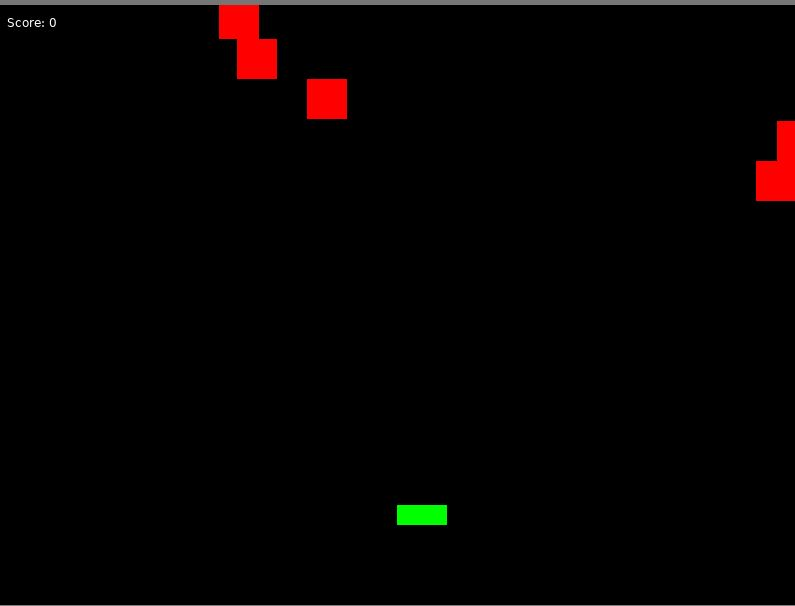

# Simple Shooter Game

This is a basic shooter game developed using the Love2D framework. The game is a simple side-scroller where you control a player to shoot down enemies and avoid collisions.

## How to Run
- make sure you have Love2D installed
- download the repo files
- open the main.lua file in a code editor
- run the file in the editor

## Controls
+ **Left Arrow Key** player to the left
+ **Right Arrow Key** player to the right
+ **Spacebar** Shoot bullets
+ **R Key** Restart

